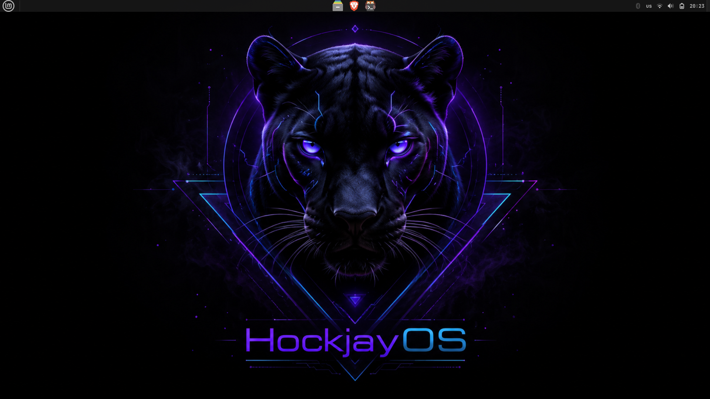
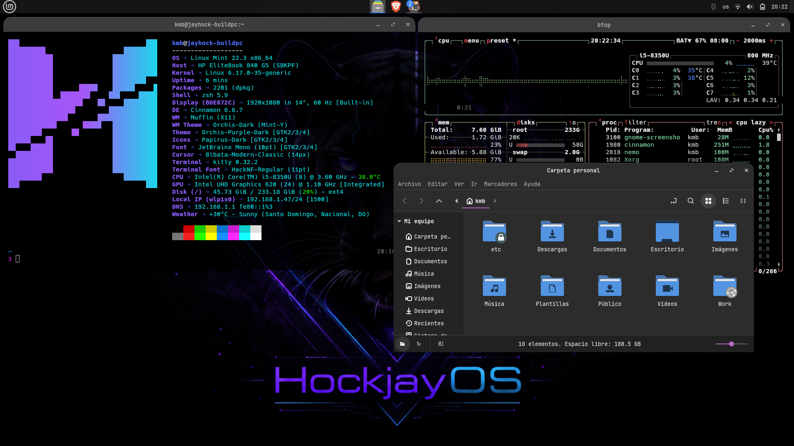

# Hockjay OS — v1.0.0 Cachorro Bombay (En desarrollo)

> *Este es un proyecto muy especial para mi y un proyecto que le recomiendo a todo entusiaste tech que le gusta trabajar en Linux como ami. Crear una version personalizada de una distro de Linux ajustada a tu persona. Esto es un reto personal y me lo quiero tomar enserio. Voy a abarcar desde las configuraciones del sistema que uso, paquetes, apps, colores, fondos de pantallas, lock screen, terminal, entre otras cosas mas.*
>
> *Voy a dejar todo claro y explicado para que si quieres tomar alguna parte o configuracion de HockjayOS, lo puedas llevar a tu distro.*
>
> *"Linux es de todos"*

---

## Objetivo

> Un entorno Linux Mint Cinnamon enfocado en desarrollo y productividad (por ahora), con identidad visual propia y configuración reproducible.

---

## ¿Qué es HockjayOS?

HockjayOS **no es una distribución nueva ni una aplicación**: es un conjunto reproducible de _dotfiles_ y scripts de automatización montado sobre **Linux Mint Cinnamon**. La idea es simple: partiendo de una instalación limpia de Mint, ejecutas los scripts de este repositorio y recuperas todo el entorno de trabajo del autor (paquetes, configuraciones, temas, fondos y terminal).

No reemplaza al gestor de paquetes ni crea repositorios propios. Todo se apoya en las herramientas estándar de Mint (`apt`, `flatpak`) para que cualquier configuración sea fácil de leer, copiar y llevar a tu propia distro.

---

## Capturas





> _Más capturas (terminal, VS Code, escritorio) en camino conforme avance el proyecto._

---

## Instalación modular

El instalador es **interactivo y por módulos**, para que instales solo lo que necesitas. Cada nivel se construye sobre **Core**.

| Módulo | Incluye | Script |
| ------ | ------- | ------ |
| **Core** | git, curl, wget, build tools, entorno Python, utilidades de terminal | `packages.sh` |
| **Developer** | Docker, tooling de Python, .NET SDK, VS Code, Neovim, herramientas de BD | `dev-tools.sh` |
| **Visual** | Orchis Dark, Papirus Dark, JetBrains Mono, wallpaper, Kitty, Fastfetch | `themes.sh` |
| **Productivity** | Obsidian, Firefox, Bitwarden | _(docs)_ |
| **Full** | Todo lo anterior | — |

```bash
git clone https://github.com/KMBMarcos/HockJayOs.git
cd HockJayOs
./scripts/install.sh
```

---

## Componentes

### 🧑‍💻 Developer Edition
- **Lenguajes / Backend:** Python, Django, .NET SDK
- **Contenedores:** Docker
- **Bases de datos:** DBeaver
- **Editores:** VS Code, Neovim

### 🎨 Visual Edition
- Tema **Orchis Dark**
- Iconos **Papirus Dark**
- Tipografía **JetBrains Mono**
- Wallpaper propio (_Panthera_)

### 💻 Terminal Edition
- **Kitty** — emulador de terminal
- **Fastfetch** — con logo ANSI personalizado

### ⚙️ VS Code Edition
- `settings.json`
- `keybindings.json`
- `extensions.txt`
- `snippets/`
- Perfiles exportados en `profiles/`

---

## Estructura

```
HockJayOs/
│
├── README.md
├── CHANGELOG.md
├── LICENSE
├── CLAUDE.md
│
├── docs/
│   ├── spec.md                 
│   ├── software-stack.md
│   ├── update-guide.md
│   └── informe-scripts-instalacion.md
│
├── configs/
│   ├── bash/
│   ├── zsh/
│   ├── git/
│   ├── kitty/
│   │   └── kitty.conf
│   ├── fastfetch/
│   │   ├── config.jsonc
│   │   └── logo/hockjay.ansi
│   ├── nvim/
│   │   ├── init.lua
│   │   └── lua/
│   └── vscode/
│       ├── settings.json
│       ├── extensions.txt
│       └── profiles/
│
├── scripts/
│   ├── install.sh              
│   ├── packages.sh             
│   ├── dev-tools.sh            
│   ├── themes.sh               
│   ├── backup.sh
│   └── lib.sh
│
├── packages/
│   ├── apt.txt
│   └── flatpak.txt
│
├── wallpapers/
│   └── hockjay-screen.png
│
├── backup/
└── releases/
```

---

## Versionado

Versionado semántico `MAJOR.MINOR.PATCH`. Cada _release_ lleva nombre de edición.
Edición actual: **v1.0.0 Bombay Edition**.

---

## 📄 Licencia

Este proyecto se distribuye bajo la **Licencia MIT**. Su uso, copia, modificación
y distribución son libres y gratuitos, con una única condición: **debe conservarse
el aviso de copyright y la mención al autor** en todas las copias o partes
sustanciales del software.

Copyright (c) 2026 KMBMarcos. Consulta el archivo [`LICENSE`](./LICENSE) para el texto completo.
